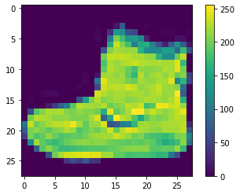
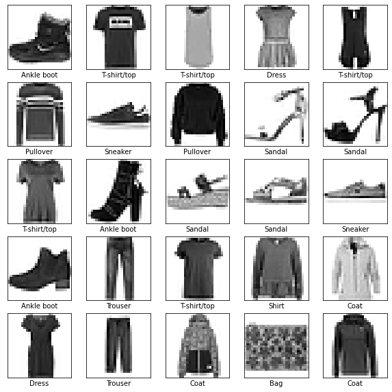
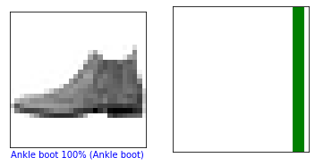
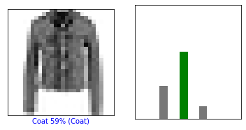
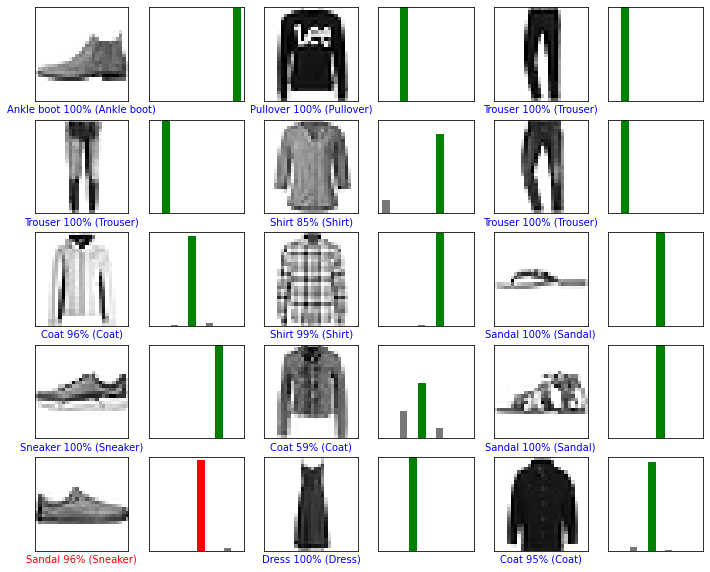
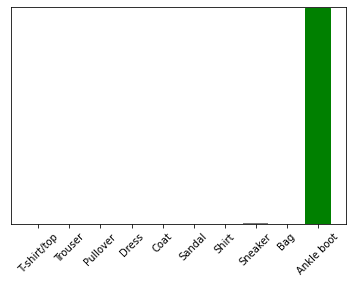

# ImageClassification_FashionMNIST
A simple image classification Neural Network Model for the Fashion MNIST dataset.

We have used Keras (A high-level API) to build and train models in Tensorflow.

We have used the Fashion MNIST dataset which contains 70,000 gray scale images in 10 categories.

The images show individual articles of clothing at low resolution which is 28x28 pixels.

We have used 60,000 images to train the network and the rest 10,000 images have been used to evaluate how accurately the network learned to classify the images.

We have also used or imported some helper libraries such as: - numpy and matplotlib

Tensorflow version: - 2.2.0

The data set loaded returns 4 numpy arrays.
Note: - The Fashion MNIST dataset is already available in keras.    (keras.datasets.fashion_mnist)

The images are 28x28 numpy arrays with pixel values ranging between 0 to 255.
The labels are an array of integers ranging from 0 to 9 and these correspond to the class of clothing the image represents.

Each image is mapped to a single label.

Note: - The class names are not included with the data set we have had to manually store them here to use later while plotting the images.

class_names = ['T-shirt/top', 'Trouser', 'Pullover', 'Dress', 'Coat', 'Sandal', 'Shirt', 'Sneaker', 'Bag', 'Ankle boot']

Before processing, we need to pre-process the data.

If we inspect the 1st image in the training set, the image pixel values fall in the range of 2 to 255.
We scale these values to range of 0 to 1 before feeding to the neural network model.
For this we divide the values by 255.0.
Note: - Its important we preprocess the training set and testing set in the same way.

Now we build the neural network model which requires configuring the layers of the model and then compiling the model.

The basic building block of a neural network is a layer. 
It extracts representations from the data fed into them and we hope these representations are meaningful for the problem at hand.

Most of the deep  learning consist of chaining together simple layers.
Most layers like the tf.keras.layers.dense have parameters that are learned during the training.

model = keras.Sequential([
                          keras.layers.Flatten(input_shape=(28, 28)),
                          keras.layers.Dense(128, activation=tf.nn.relu),
                          keras.layers.Dense(10, activation=tf.nn.softmax)
])

Here, we have our model which is keras.Sequential and we have used the flatten and the dense layer.

The input shape is 28x28
The 1st layer in this network i.e. tf.keras.layers.Flatten it transfrms the format of the images from a 2D array of 28x28 to a 1D array of 28x28 which is 784 pixels.
This layer unstacks rows of pixels in the image and lining them up.
This layer has no parametersto learn it only reformats the data.

Now after the pixels are flattened the network consists of a sequence of 2 dense layers.

These are densely connected or fully connected neural layers.

The 1st dense layers have 128 nodes or basically 128 neurons.

The last layers have 10 nodes with softmax layer and this returns an array of 10 probability scores that sum to 1.

Now each node contains a score that indiates the probability that the current image belongs to one of the 10 classes.

Next we compile the model.

model.compile(optimizer='adam', loss='sparse_categorical_crossentropy', metrics=['accuracy'])

But before the model is ready for training, it needs few more settings.
For example, 
1. We have the loss function which measures how accurate the model is during the training and we want to minimize the function to steer the model in the right direction.
2. The optimizer updates the model based on the data it sees and its loss function.
3. The metrics are used to monitor the training and testing steps and the following uses the accuracy which is the fraction of the images that are correctly classified.

Training the model steps: - 

1. Feeding the training data to the model (train_images & train_labels arrays)

2. After that the model learns to associate the images and labels.

3. After that we ask the model to make predictions about a test set. (test_images arrays)

4. We verify that the predictions matches the labels from the test_label array.

model.fit(train_images, train_labels, epochs=10)

After running the training model, the loss is 0.24 and the accuracy is 90.89%.

Next we evaluate the accuracy i.e we compare how the  model performs on the test data set.

test_loss, test_acc = model.evaluate(test_images, test_labels)

print('Test accuracy:', test_acc)

The accuracy seems to be 88% approx on the test.
This gap between the training accuracy and testing accuracy is an example of "Overfitting"

Overfitting: - It is when a ML model performs worse on a new data than on the training data.

Now, we make predictions with the model_train about some images

predictions = model.predict(test_images)

Here the model has predicted the label for each image in the testing set.

We take a look at the 1st prediction: predictions[0]
array([3.0915174e-08, 3.7119971e-10, 1.6799572e-08, 2.8706122e-08,
       4.5539106e-10, 2.8371852e-04, 9.8056141e-08, 3.9659943e-03,
       3.5133322e-08, 9.9575007e-01], dtype=float32)
       
Our prediction is an array of 10 numbers, these describe the confidence of the model that the image corresponds to each of the 10 different articles of clothing.

So, we can see which label has the highest confidence value: np.argmax(predictions[0]) = 9 i.e an ankle boot or the class number 9.
We verify if the test_label sees it as the correct output: test_labels[0] = 9.

Now we graph it further to look at the full set of 10 channels.

Now we look at the several image predictions individually and the prediction array.

Now we plot the several images with the prediction: - 
1. The correct prediction labels are green
2. The incorrect ones are red
3. We get the number as correct % out of 100 for the predicted label and it can be wrong

For example, in our dataset, the sneaker is classified as a sandal however it is identified as 96% sandal which is incorrect.

Now finally we use the trained model to make a prediction about a single image: - 

img = test_images[0]
img = (np.expand_dims(img,0))
predictions_single = model.predict(img)
print(predictions_single)

[[3.0915174e-08 3.7119971e-10 1.6799602e-08 2.8706067e-08 4.5539192e-10
  2.8371852e-04 9.8055949e-08 3.9660018e-03 3.5133390e-08 9.9575007e-01]]
  
So, the model.predict returns a list of lists one of each image in the batch of data.

Now, we grab the predictions for our only image in the batch

plot_value_array(0, predictions_single, test_labels)
_=plt.xticks(range(10), class_names, rotation=45)

We find that the model projects a label of 9 which is the ankle boot.

So, this is an example to classify images creating a small neural network of 3 layers but the image sizes are small, it is 28x28 pixels and comparatively easier to classify.
